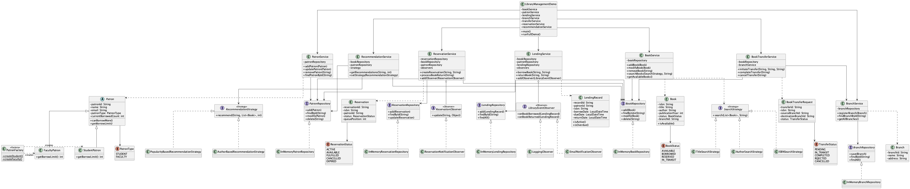

# 📚 Library Management System

A comprehensive Java-based library management system demonstrating industry-standard design patterns, clean architecture, and SOLID principles.

## 🌟 Overview

This system manages library operations including book inventory, patron management, lending services, multi-branch coordination, reservations, and personalized recommendations. Built with Java 17+ and implementing 5 major design patterns across a clean layered architecture.

## ✨ Features

### Core Features
- ✅ Book Management (Add, Update, Remove, Search)
- ✅ Patron Management (Create, Update with Factory Pattern)
- ✅ Book Search (Strategy Pattern: Title, Author, ISBN)
- ✅ Borrowing & Return System
- ✅ Inventory Management
- ✅ Patron Status & Limits Tracking
- ✅ Multiple Concurrent Borrows
- ✅ Active Lending Records

### Advanced Features
- 🏢 **Multi-Branch System** - Manage multiple library locations
- 🔄 **Book Transfers** - Inter-branch book transfers with audit trail
- 📋 **Reservation Queue** - FIFO queue with automatic notifications
- 💡 **Smart Recommendations** - Personalized book suggestions using multiple strategies

## 🏗️ Architecture

### Class Diagram

### Complete UML Class Diagram



**Full diagram showing all classes, interfaces, and relationships. Click to view full size.**

> **Note**: The diagram includes:
> - All domain entities with their attributes and methods
> - Service layer with business logic components
> - Repository layer with data access interfaces
> - Design patterns (Factory, Strategy, Observer) implementation
> - All relationships: inheritance, dependencies, associations

### Quick Architecture Overview

```
┌─────────────────────────┐
│ LibraryManagementDemo   │
│       (Main App)        │
└──────────┬──────────────┘
           │
           │ uses
           ▼
┌─────────────────────────┐
│     Service Layer       │
├─────────────────────────┤
│  BookService            │
│  PatronService          │
│  LendingService         │
│  BranchService          │
│  ReservationService     │
│  RecommendationService  │
└──────────┬──────────────┘
           │
           │ depends on
           ▼
┌─────────────────────────┐        ┌─────────────────────────┐
│   Repository Layer      │        │    Pattern Layer        │
├─────────────────────────┤        ├─────────────────────────┤
│  BookRepository         │        │  PatronFactory          │
│  PatronRepository       │        │  SearchStrategy         │
│  LendingRepository      │◄───────│  RecommendationStrategy │
│  BranchRepository       │        │  LibraryEventObserver   │
│  ReservationRepository  │        │  ReservationObserver    │
└──────────┬──────────────┘        └─────────────────────────┘
           │
           │ manages
           ▼
┌─────────────────────────┐
│     Domain Layer        │
├─────────────────────────┤
│  Book                   │
│  Patron                 │
│    ├─ StudentPatron     │
│    └─ FacultyPatron     │
│  LendingRecord          │
│  Branch                 │
│  Reservation            │
│  BookTransferRequest    │
└─────────────────────────┘
```

### Separation of Concerns

| Layer | Responsibility | Example |
|-------|----------------|---------|
| **Presentation** | User interaction, demo orchestration | `LibraryManagementDemo.java` |
| **Service** | Business logic, validation, workflow coordination | `BookService`, `LendingService` |
| **Repository** | Data access, CRUD operations | `BookRepository`, `PatronRepository` |
| **Domain** | Business entities, rules, validation | `Book`, `Patron`, `LendingRecord` |

## 📦 Project Structure

```
src/main/java/org/librarymanagement/
├── LibraryManagementDemo.java          # Main application
├── mainentities/                       # Domain Layer
│   ├── Book.java
│   ├── Patron.java
│   ├── PatronFactory.java             # Factory Pattern
│   ├── LendingRecord.java
│   ├── Branch.java
│   ├── Reservation.java
│   └── BookTransferRequest.java
├── service/                           # Service Layer
│   ├── BookService.java
│   ├── PatronService.java
│   ├── LendingService.java
│   ├── BranchService.java
│   ├── BookTransferService.java
│   ├── ReservationService.java
│   └── RecommendationService.java
├── repository/                        # Repository Layer
│   ├── BookRepository.java
│   ├── PatronRepository.java
│   ├── LendingRepository.java
│   ├── BranchRepository.java
│   └── ReservationRepository.java
├── observer/                          # Observer Pattern
│   ├── LibraryEventObserver.java
│   ├── ReservationObserver.java
│   ├── LoggingObserver.java
│   ├── EmailNotificationObserver.java
│   └── ReservationNotificationObserver.java
└── strategy/                          # Strategy Pattern
    ├── SearchStrategy.java
    ├── TitleSearchStrategy.java
    ├── AuthorSearchStrategy.java
    ├── ISBNSearchStrategy.java
    ├── RecommendationStrategy.java
    ├── AuthorBasedRecommendationStrategy.java
    └── PopularityBasedRecommendationStrategy.java
```

## 🎨 Design Patterns

| Pattern | Classes | Purpose |
|---------|---------|---------|
| **Factory** | `PatronFactory`, `StudentPatron`, `FacultyPatron` | Create patron objects with different privileges |
| **Strategy** | `SearchStrategy`, `TitleSearchStrategy`, `AuthorSearchStrategy`, `ISBNSearchStrategy`, `RecommendationStrategy`, `AuthorBasedRecommendationStrategy`, `PopularityBasedRecommendationStrategy` | Interchangeable search and recommendation algorithms |
| **Observer** | `LibraryEventObserver`, `ReservationObserver`, `LoggingObserver`, `EmailNotificationObserver`, `ReservationNotificationObserver` | Event-driven notifications for library operations |
| **Repository** | `BookRepository`, `PatronRepository`, `LendingRepository`, `BranchRepository`, `ReservationRepository` | Abstract data access from business logic |
| **Service Layer** | `BookService`, `PatronService`, `LendingService`, `BranchService`, `BookTransferService`, `ReservationService`, `RecommendationService` | Encapsulate business logic and coordinate workflows |


## 🚀 Prerequisites

- **Java**: JDK 17 or higher
- **Gradle**: 8.x (included via wrapper)
- **IDE**: IntelliJ IDEA, Eclipse, or VS Code (optional)

## ⚙️ Setup & Installation

### 1. Clone the Repository
```bash
git clone <repository-url>
cd library-management-system/LibraryManagementSystem
```

### 2. Build the Project
```bash
./gradlew build
```

### 3. Run the Application
```bash
./gradlew run
```

### 4. Run Tests
```bash
./gradlew test
```

## 💻 Example Code

### Basic Usage

```java
// Initialize repositories
BookRepository bookRepository = new InMemoryBookRepository();
PatronRepository patronRepository = new InMemoryPatronRepository();
LendingRepository lendingRepository = new InMemoryLendingRepository();

// Initialize services
BookService bookService = new BookService(bookRepository);
PatronService patronService = new PatronService(patronRepository);
LendingService lendingService = new LendingService(
    bookRepository, patronRepository, lendingRepository
);

// Add a book
Book book = new Book("978-0134685991", "Effective Java", "Joshua Bloch", 2017);
bookService.addBook(book);

// Create a patron using Factory Pattern
Patron student = PatronFactory.createStudent(
    "John Doe", 
    "john@university.edu", 
    "555-0101"
);
patronService.addPatron(student);

// Search books using Strategy Pattern
List<Book> results = bookService.searchBooks(
    new TitleSearchStrategy(), 
    "Java"
);

// Borrow a book
LendingRecord record = lendingService.borrowBook(
    book.getIsbn(), 
    student.getPatronId()
);

// Return a book
lendingService.returnBook(book.getIsbn(), student.getPatronId());
```

### Advanced Features

```java
// Book Transfer Between Branches
BookTransferService transferService = new BookTransferService(
    bookRepository, branchService
);

BookTransferRequest transfer = transferService.initiateTransfer(
    "978-0134685991",  // ISBN
    "BR001",           // Source Branch
    "BR002"            // Destination Branch
);

transferService.completeTransfer(transfer.getTransferId());

// Reservation System
ReservationService reservationService = new ReservationService(
    reservationRepository, bookRepository, patronRepository
);

Reservation reservation = reservationService.createReservation(
    "978-0134685991",           // ISBN
    student.getPatronId()       // Patron ID
);

// Book Recommendations
RecommendationService recommendationService = new RecommendationService(
    bookRepository, patronRepository, 
    new AuthorBasedRecommendationStrategy()
);

List<Book> recommendations = recommendationService.getRecommendations(
    student.getPatronId(), 
    5  // Number of recommendations
);

// Switch recommendation strategy at runtime
recommendationService.setStrategy(
    new PopularityBasedRecommendationStrategy()
);
```

### Observer Pattern - Event Notifications

```java
// Add observers for automatic notifications
lendingService.addObserver(new LoggingObserver());
lendingService.addObserver(new EmailNotificationObserver());

reservationService.addObserver(new ReservationNotificationObserver());

// Events are automatically triggered:
// - When books are borrowed/returned
// - When reservations are created
// - When reserved books become available
```

## 🛠️ Technology Stack

| Technology | Version | Purpose |
|------------|---------|---------|
| Java | 17+ | Programming Language |
| Gradle | 8.x | Build Tool |
| SLF4J | 2.0.9 | Logging Facade |
| Logback | 1.4.11 | Logging Implementation |

## 📚 Documentation

- **[DESIGN_DOCUMENTATION.md](DESIGN_DOCUMENTATION.md)** - Complete technical documentation
- **[DEMO_GUIDE.md](DEMO_GUIDE.md)** - Feature walkthrough and usage guide
- **[SUBMISSION_SUMMARY.md](SUBMISSION_SUMMARY.md)** - Project summary

## 🎯 Key Highlights

✅ **15 Features** - 12 core requirements + 3 advanced features  
✅ **5 Design Patterns** - Factory, Strategy, Observer, Repository, Service Layer  
✅ **SOLID Principles** - Comprehensive adherence throughout  
✅ **Clean Architecture** - Clear separation of concerns  
✅ **100% Functional** - All features working and demonstrated  
✅ **Well Documented** - Complete technical and user documentation  

## 📄 License

This project is created for educational purposes.

## 👤 Author

[Sai Sandeep Bollavaram]

## 🤝 Contributing

This is an educational project. Feel free to fork and experiment!

---

**Built with ❤️ using Java and Design Patterns**
